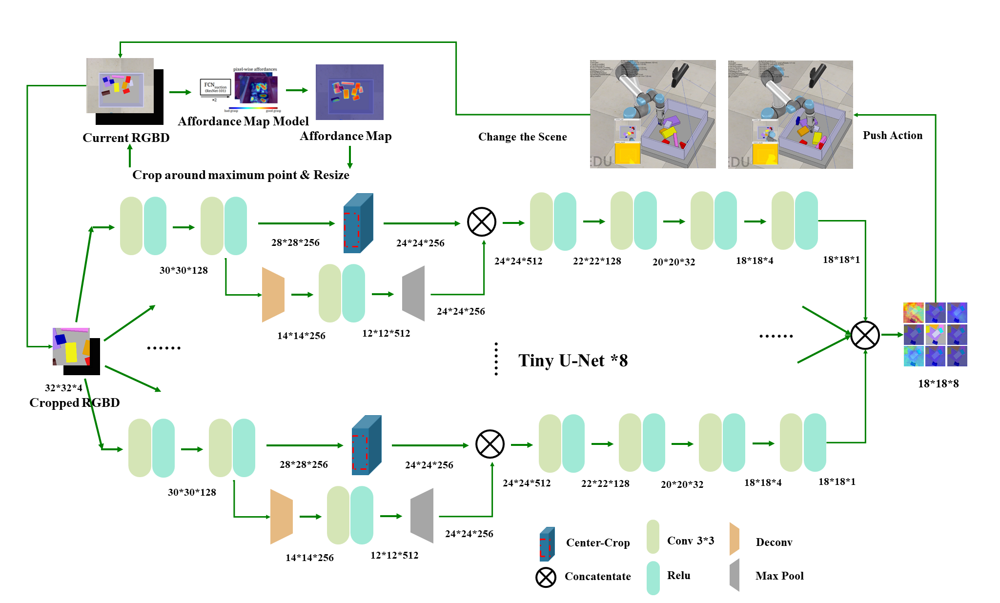

# Active_Exploration

An quick official reproduce repo for the paper: [Deep Reinforcement Learning for Robotic Pushing and Picking in Cluttered Environment](https://ieeexplore.ieee.org/document/8967899) appeared in IROS 2019, by Yuhong Deng\*, Xiaofeng Guo\*, [Yixuan Wei](weiyx16.github.io)\*, Kai Lu\*, Bin Fang, Di Guo, Huaping Liu, Fuchun Sun.  

This work combine [Affordance map](http://arc.cs.princeton.edu) with active exploration policy by deep reinforcement learning to increase manipulation success rate. Especially, we designed a composite robotic manipulator including two paralleled fingers and a suction cup. By introducing promising strategy into grasping process, we make a definite improvement on robot grasping in clutter scenes.  

## A new operation hand design

We designed a new kind of robot manipulator with a suction cup and fingers, for details, please ref to the source paper.

## DQN & Affordance map

This repo is main for quick reproduce the DQN model and training scheme we used in this paper. Noticed this repo doesn't build with strong support, but only for referece when you want to rebuild the pipeline. The directory *affordance_model* is the inference code in Lua&Torch from [Affordance map model](http://arc.cs.princeton.edu). And to create affordance map for each image, please download its model, put in a suitable location and change the code of L22 in [infer.lua](./affordance_model/infer.lua). The directory *DQN* is our model of combining U-Net Structure and DQN to output action over sub-pixelwise location, for details, please see [ReadMe.md](./DQN/README.md)
